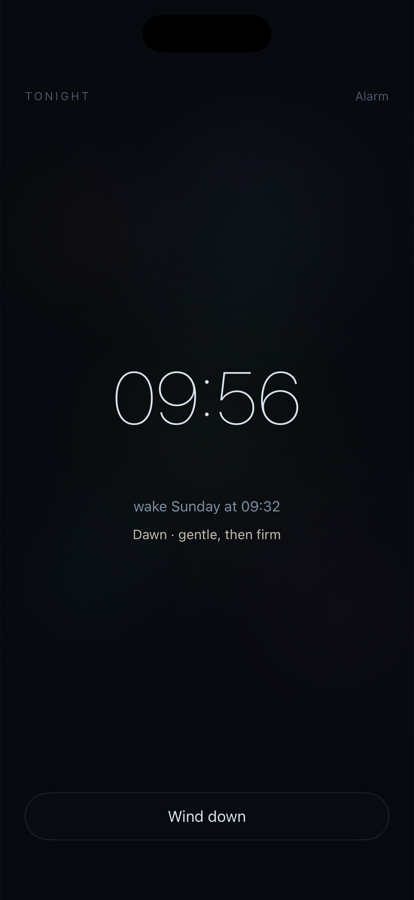
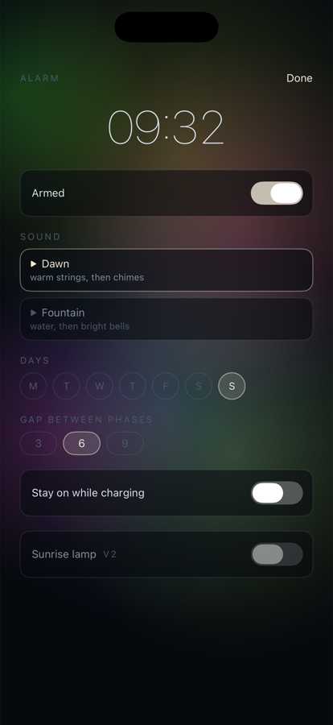

# Fathom

An iOS alarm clock that wakes you in two phases. A gentle sound plays at the time you set. Then comes a silent gap, whose length you chose the night before. Then a firm sound climbs for two minutes and holds. Say "I'm up" at any point and everything after it is cancelled. There is no snooze button anywhere in the app.

The Loftie bedside clock gets two things right: a two-stage wake, and sounds worth waking to. It gets one thing wrong: it plays the second stage whether or not you are already awake. Fathom keeps the two-stage wake and fixes the third, on the phone that is already on the nightstand. The sounds are still placeholders; composing them is milestone 4.

<p>
  
  &nbsp;
  
</p>

**Status:** on TestFlight as *Fathom Alarm*. Two rounds of testing on an iPhone 15 Pro have shaped the build, but it has not yet passed the reliability matrix in [DESIGN §9](DESIGN.md#9-reliability-test-matrix), so I don't rely on it as my only alarm.

## Design first

[DESIGN.md](DESIGN.md) was written before any code. It has been revised twice since, both times because the phone disagreed with it. Four of its principles carry most of the weight:

- **The gap replaces snooze.** You choose the grace period (3, 6 or 9 minutes) the night before, when you are awake enough to mean it, not at 6 a.m. while half asleep.
- **Local-first.** No accounts, no backend, no analytics. The only failure that matters is a missed alarm, and a server is one more way to cause one.
- **Every setting earns its place.** The design caps the settings at six: time, sound, days, gap, bedside mode and a sunrise lamp reserved for v2.
- **No daytime destination.** Nothing rewards opening the app during the day. Accounts, sleep tracking, streaks and anything social are permanently out of scope.

The visual identity is one image. The screen is the surface of dark water seen from above, with six slowly drifting blooms of colored light beneath it. How deep the light sits encodes the time of day: dim at night, rising during the wake, clearly visible on the daytime settings screen. The interface uses one color, warm white; the water supplies every other one. A version with figurative "eels" of light was prototyped and dropped in favor of formless light. The reference is an interactive web prototype ([prototype/design-prototype.html](prototype/design-prototype.html); download it and open it in a browser), and the SwiftUI scene reproduces its drawing constants exactly.

## Engineering notes

**One morning is 31 system alarms.** AlarmKit, Apple's alarm framework, schedules single alarms. Fathom needs a chain of them: phase 1, then five escalating 30-second sounds played back to back, then a plateau sound that repeats every 30 seconds up to a 15-minute cap. AlarmKit's repeating schedules only resolve to the minute, and the chain steps every 30 seconds. So each member is scheduled for an exact date, for the next morning only. Every chain is rebuilt whenever the app becomes active, except while an alarm is in progress, because a rebuild would cancel it. On device, AlarmKit accepted all 27 members of the chain's previous schedule; the current 31 are not yet confirmed.

**Stop means "I'm up."** Because there is no snooze, the system alert's stop button carries a single intent that holds the parent alarm's ID. The engine uses it to cancel every remaining member of the chain, then schedules that alarm's next morning. Stopping during phase 1 or the gap means phase 2 never plays, and that is the improvement over the Loftie. Device testing confirmed that the intent reaches the app from the system alert.

**The app never stores "ringing."** Where the wake stands (phase 1, gap, rising, plateau) is computed from the clock and the saved chain whenever the app becomes active. Relaunching mid-alarm, even after a force-quit, lands on the right screen, with the scene and audio positioned by the time elapsed since phase 2 began.

**What the phone showed that the simulator could not:**

- Phase 2 originally left 15 to 60 seconds of silence between its steps. Half-asleep, the silence read as the alarm giving up. The steps now play back to back, which is why the chain grew from 27 members to 31.
- Alarms fired in silence. AlarmKit looks up sound files by their full name, including the `.caf` extension, and the chain was passing names without it.
- On an OLED screen in a dark room, the wake scene looked black for its first 90 seconds. Phase 2 now opens at daytime depth and keeps rising past it.
- The placeholder tones were too quiet, and their fundamentals sat below what an iPhone speaker can reproduce, so the gentle phase could not be heard.

A persisted event log records each intent, dismissal and reschedule, so a night's run can be reconstructed from the device the next morning.

## Known risks

- **Tomorrow depends on today's stop.** Each alarm is scheduled one morning ahead, and the next morning is scheduled when the alarm is stopped or the app is opened. If the stop intent fails and the app is never opened, a repeating alarm has nothing scheduled for the day after.
- **Rebuilds are not yet atomic.** A chain's member IDs are saved only after all of its alarms are scheduled. If iOS suspends the app partway through, AlarmKit holds alarms that the engine has no record of, and "I'm up" cannot cancel them.
- **The backup chain is a stopgap.** A second chain of local notifications trails phase 1, each escalation step and three plateau checkpoints by 30 seconds, and fires whether or not AlarmKit did, until the alarm is dismissed. Nine per morning keeps it inside iOS's limit of 64 pending notifications per app. Unlike AlarmKit it obeys the silent switch, and it lacks the Time Sensitive entitlement that would let it through Sleep Focus.

## Status by milestone

| # | Milestone | State |
|---|---|---|
| 1 | Alarm chain on real hardware | The 27-member chain was accepted on device and the stop intent works. The current 31-member chain and most rows of the reliability matrix (silent switch, restart overnight, Low Power Mode) are untested |
| 2 | Water scene ported from the prototype | Done in the app. The lock-screen Live Activity renders it in code, unconfirmed on device |
| 3 | Three screens: Tonight, Alarm, Wake | Done, with placeholder audio and local JSON storage |
| 4 | First composed sound pair | Not started; *Dawn* will be written in Logic to the brief in DESIGN §6 |
| 5 | Daily-driver build | On TestFlight. Done when the reliability matrix passes two weeks running and a second sound pair exists. Whether it goes to the App Store is decided after that, not before |

## Building

Requires Xcode 26.1 or later (AlarmKit, iOS 26.1 deployment target). The Xcode project is generated from `project.yml`:

```
brew install xcodegen   # once
xcodegen generate
open Fathom.xcodeproj
```

AlarmKit's behavior cannot be trusted in the simulator; alarm testing happens on a device. Placeholder sounds are checked in under `Fathom/Resources/Sounds/`, and `python3 scripts/make_placeholder_sounds.py` regenerates them with no dependencies beyond the system `afconvert`. TestFlight uploads run from the command line with an App Store Connect API key. Bump `CURRENT_PROJECT_VERSION` in `project.yml` before each one, because App Store Connect rejects a build number it has already seen.

## Layout

| Path | Contents |
|---|---|
| `Fathom/Alarms/` | Chain scheduling, the stop intent, the backup notification chain, the event log |
| `Fathom/Scene/` | The water scene and the depth assigned to each state |
| `Fathom/Screens/` | Tonight, Alarm and Wake. There is no fourth screen |
| `Fathom/Audio/` | In-app wake audio, the wind-down fade, sound previews |
| `Fathom/Models/`, `Fathom/Store/` | Alarm model, chain timing, the JSON store |
| `FathomWidgets/` | Lock-screen Live Activity |
| `scripts/` | Placeholder sound synthesis |

---

Built by [Shane Haynes](https://github.com/shanehaynes). Much of the implementation was written with Claude Code, as the commit trailers show.
